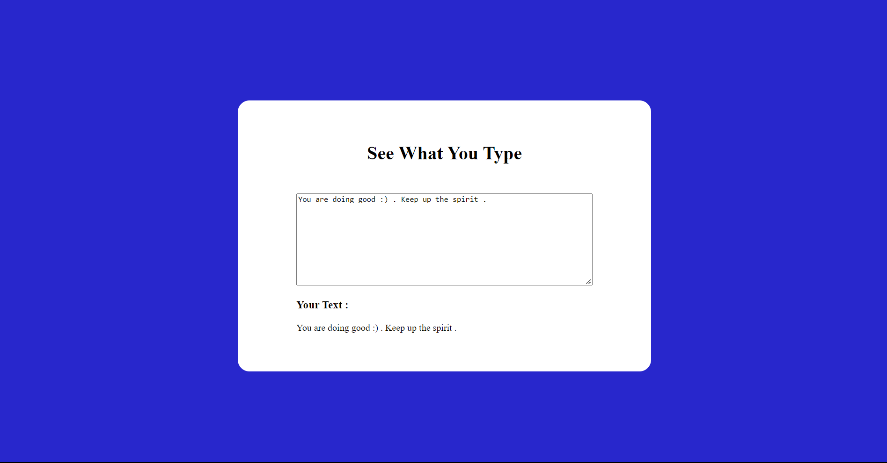

# JavaScript Project - See What You Type

## **Project: A Simple DOM Manipulation practice**

### Concepts learned from this project:
- A Simple DOM Manipulation practice to see what you type inside input TextArea.

**Live Link :** [Deployed Link](https://js-project-seewhatutype.netlify.app/)
>### Preview :

